# Mapping Slaughterhouse Supply Zones: A Reproducible, Geographically Generic Walkthrough

**A plain-language companion to Brandão Jr., Rausch, Munger & Gibbs (2023), *Land*, 12(9), 1782**

> **A note on the data.** Every figure, table, and number in this report is computed from a fictitious dataset built specifically for this repository. No confidential cattle-transit (GTA), rural property registry (CAR), or slaughterhouse record is used or reproduced anywhere in this document. The workflow reconstructs the *analytical logic* of Brandão Jr. et al. (2023, *Land*, 12(9), 1782) in open-source tools, not its empirical findings.

## Executive summary

A single animal can pass through several farms before it ever reaches a
slaughterhouse: born on one property, raised on a second, fattened on a
third. Purchase records typically show only the last step, the sale to the
plant, so a company or regulator who wants to know where its cattle actually
came from is left trying to reconstruct a chain of custody from a single
snapshot. This report walks through a complete, open-source, and
geographically generic workflow that tackles that problem by estimating the
**supply zone** of each slaughterhouse: the geographic area where its
cattle most plausibly originate, split into farms that sell straight to the
plant (direct suppliers) and farms that sell only through a middle step
(tier-1 indirect suppliers). Unlike the original study this workflow is
based on, which was built around one country, this version can be pointed at
any region in the world simply by naming it in the project configuration.
Real administrative boundaries are then fetched automatically from
OpenStreetMap or the public-domain Natural Earth dataset, both open and
globally available, and the workflow falls back to a deterministic offline
layout only if neither can be reached. Using an illustrative synthetic
dataset configured for Rondônia, Mato Grosso, Pará, spanning 3 regions,
12 slaughterhouses, and the years 2013-2018, the workflow finds that
the average direct supply zone of a signatory plant (a plant that has joined
a public sourcing commitment) covers about 1.9 million
hectares, that roughly a quarter of that area is natural vegetation, and
that extending monitoring further out to indirect suppliers or to plants
without a sourcing commitment would substantially widen how much of the
cattle trade is actually covered, at the cost of a much larger area to keep
track of. Because every number below is computed from fictitious data built
specifically for this repository, none of it describes anything about real
cattle, farms, or companies; the value of the exercise lies entirely in the
method, which can be pointed at a real dataset once one is available.

## 1. Why supply zones matter

Companies, regulators, and civil-society groups that want to know whether
cattle products are linked to deforestation run into a basic geographic
problem before they can even start: a purchase record names a
slaughterhouse, not a location on a map, and certainly not the pasture where
an animal actually grazed. A supply zone is a way of closing that gap. It
translates a plant's likely catchment area for cattle into an explicit
polygon that can be laid on top of other spatial data, land use, recent
deforestation, or the boundaries of protected areas, so that a concrete
question can finally be answered: how much of a plant's likely sourcing area
still has forest cover, and how does that compare between plants that have
signed a public sourcing commitment (referred to throughout this report as
"signatory" plants, after Brazil's Cattle Agreement, the real-world case
this workflow was originally built around) and plants that have not.

Estimating a supply zone is harder than it sounds, though, because most of
the trail is invisible. An animal's ownership can change hands two, three,
or more times between birth and slaughter, and every one of those
intermediate sales is a point where a buyer's sourcing commitment can
quietly stop applying, a pattern sometimes called cattle laundering. The
original study this repository reconstructs tackled that problem using
confidential cattle-transit permits (GTA, in the Brazilian system) and rural
property registrations (CAR), processed through proprietary ArcGIS
routines. Those routines are not published in full, and the underlying
records cannot be shared, which makes the published method difficult for an
outside reader to check or adapt. This repository asks a narrower, more
mechanical question with synthetic stand-in data instead: can the same
analytical logic be reproduced end to end using transparent, open-source
tools, and does building it that way change how the results should be read
or where they might mislead. Full methodological detail, including every
explicit decision made where the original publication left a parameter
unspecified, is in `docs/METHODS.md`; this report stays at the level of what
each result means for a reader without a background in spatial statistics
or supply-chain traceability.

## 2. Study design in brief

The workflow simulates 6 years of fictitious cattle-transit records,
rural property boundaries, slaughterhouse locations, land use, and
deforestation across 3 regions. It then works through five stages,
each one resolving a specific gap in the raw records:

1. **Links each transit record to a property** using deterministic matching
   rules based on tax identifiers, owner names, and municipality, since the
   transit system and the property registry are separate databases that do
   not share a common key.
2. **Classifies slaughterhouses as eligible** when they process more than
   1,000 head per year and hold a sanitary inspection code, matching the
   thresholds used in the source study; this filters out very small or
   informal operations for which a supply zone would be statistically
   meaningless.
3. **Identifies direct suppliers** (properties that sell straight to an
   eligible plant) and **tier-1 indirect suppliers** (properties that sell
   to a direct supplier, using the same 16-head minimum transaction
   threshold), which is the step that reconstructs one link of the hidden
   ownership chain described in Section 1.
4. **Chooses, separately for every plant and year, the distance at which
   cattle-volume-weighted spatial clustering (Global Moran's I) peaks**, and
   uses that distance to aggregate supplier properties into a single supply
   zone (an open-source analogue of the original ArcGIS Aggregate Polygons
   step). In plain terms, Moran's I asks whether nearby supplier properties
   tend to sell similar volumes of cattle to the same plant more often than
   chance would predict; the distance at which that pattern is strongest is
   read as the natural edge of the plant's catchment, rather than an
   arbitrary fixed radius applied to every plant alike.
5. **Cross-tabulates the resulting zones** against land use, deforestation,
   carbon density, and protected or military areas, which is what turns a
   plain polygon into an answer to the forest-cover question posed in
   Section 1.

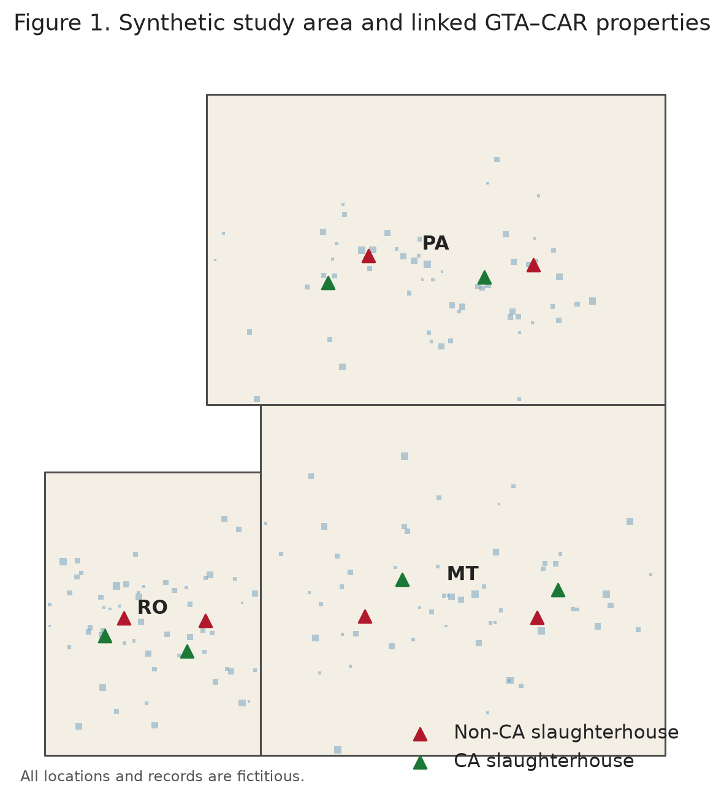

<p class="figure-caption">Figure 1. Synthetic study area, slaughterhouse locations, and linked properties.</p>

## 3. How large are supply zones, and how much do they overlap

| Zone type | Zone-years observed | Mean annual area (million ha) | Median annual area (million ha) | Mean number of properties |
| --- | --- | --- | --- | --- |
| Signatory direct | 36 | 1.9 | 0.9 | 15.2 |
| Signatory tier-1 indirect | 36 | 0.1 | 0.0 | 2.9 |
| Non-signatory direct | 36 | 1.5 | 1.3 | 18.0 |
| Non-signatory tier-1 indirect | 36 | 0.1 | 0.0 | 3.6 |

Signatory plants have direct supply zones that are, on average, larger than
their non-signatory counterparts in this synthetic dataset, largely because
signatory plants tend to source from more properties in the first place. The
zones are not neat, mutually exclusive territories: a single property can
sit inside more than one plant's catchment at once, and different zone types
can cover much of the same ground. That matters in practice because a
company auditing only its own direct supply zone may be looking at land that
a competitor, or a non-signatory plant, is drawing from just as heavily. The
table below reports the **Jaccard overlap index**, a standard way of scoring
how much two areas share: it divides the size of their intersection by the
size of their combined footprint, so a value near 0% means the two zone
types barely touch and a value near 100% means they occupy almost exactly
the same ground.

| Zone type A | Zone type B | Share of A inside B (%) | Share of B inside A (%) | Overlap index, Jaccard (%) |
| --- | --- | --- | --- | --- |
| Signatory direct | Signatory tier-1 indirect | 5.6% | 65.2% | 5.4% |
| Signatory direct | Non-signatory direct | 54.3% | 50.7% | 35.6% |
| Signatory direct | Non-signatory tier-1 indirect | 8.1% | 58.6% | 7.6% |
| Signatory tier-1 indirect | Non-signatory direct | 70.1% | 5.6% | 5.5% |
| Signatory tier-1 indirect | Non-signatory tier-1 indirect | 45.9% | 28.5% | 21.3% |
| Non-signatory direct | Non-signatory tier-1 indirect | 11.7% | 90.9% | 11.6% |

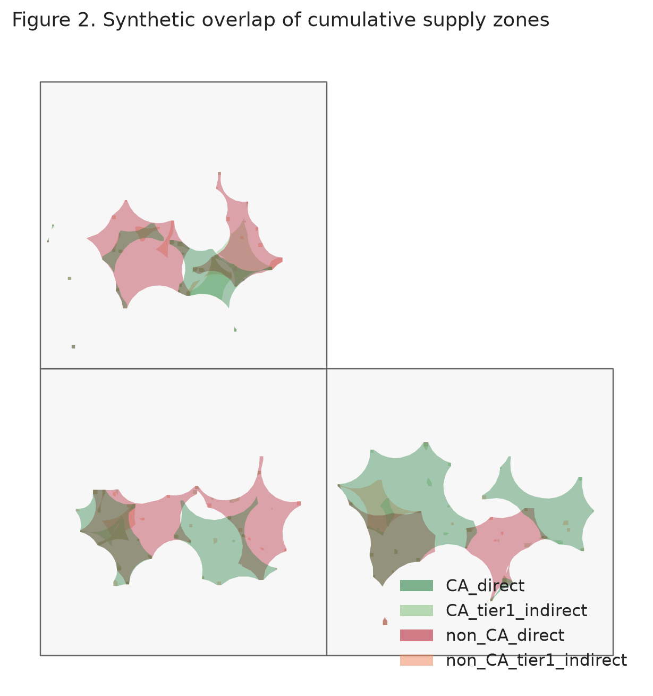

<p class="figure-caption">Figure 2. Cumulative overlap of all four supply-zone types, 2013-2018.</p>

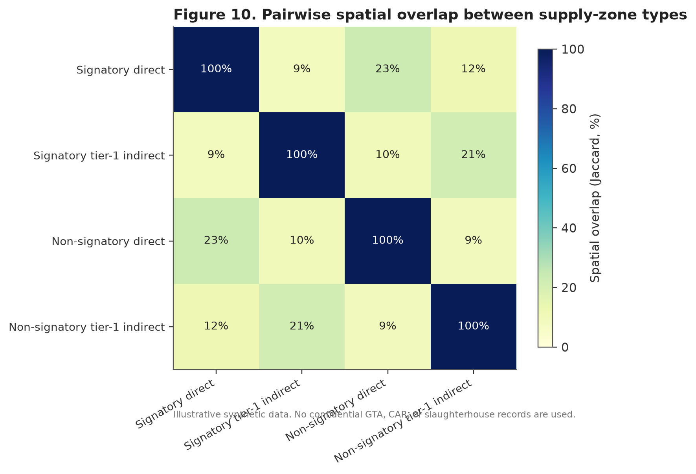

<p class="figure-caption">Figure 10. Pairwise spatial overlap between zone types, summarized as a Jaccard index.</p>

## 4. Does the same area stay in the supply zone every year

Not every property that shows up in a supply zone one year belongs there
every year; a farm might sell to a given plant once and never again,
because of a one-off price advantage or a chance connection. That kind of
one-year appearance is a much weaker basis for ongoing monitoring than a
property that supplies the same plant consistently, since resources spent
verifying a supplier who will not sell there again are largely wasted. To
tell the two apart, the workflow tracks, pixel by pixel across the whole
study area, how many of the 6 years each location falls inside the
signatory direct supply zone; a location that appears in all 6 years
is a stable, recurring part of the plant's catchment, while one that
appears only once is closer to noise.

| Years covered out of 6 | Cumulative area (thousand ha) | Share of the ever-covered footprint (%) |
| --- | --- | --- |
| 1 | 750.0 | 4.8% |
| 2 | 1,470.0 | 9.5% |
| 3 | 1,460.0 | 9.4% |
| 4 | 3,700.0 | 23.9% |
| 5 | 4,320.0 | 27.9% |
| 6 | 3,780.0 | 24.4% |

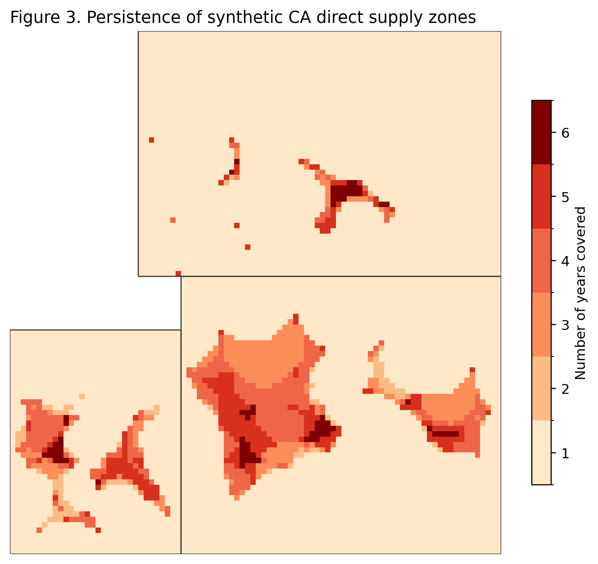

<p class="figure-caption">Figure 3. Number of years each location falls inside the signatory direct supply zone.</p>

## 5. What land cover is inside each supply zone

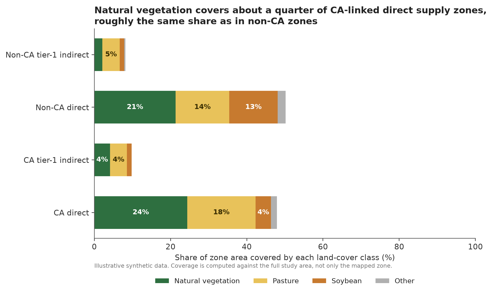

<p class="figure-caption">Figure 4. Land-cover composition inside each supply-zone type.</p>

Knowing how large a supply zone is says little on its own; what matters for
a deforestation question is what covers the ground inside it. Every
property in the workflow is cross-tabulated against four simplified
land-cover classes: natural vegetation, pasture, soybean cropland, and a
residual "other" category. For the natural-vegetation figure specifically,
officially protected areas and military land are excluded from the
denominator, since that land cannot legally be cleared regardless of who
owns the cattle passing through the zone; leaving it in the calculation
would understate how much of the *legally convertible* land inside a supply
zone is still forested, which is the figure that actually matters for
assessing deforestation risk going forward.

## 6. Deforestation and carbon inside the signatory direct zone

| Zone type | Deforestation, 2008-2018 (thousand ha) | Committed emissions, 2008-2018 (MtCO2e) |
| --- | --- | --- |
| Signatory direct | 1.2 | 0.5 |
| Signatory tier-1 indirect | 0.5 | 0.0 |
| Non-signatory direct | 2.4 | 0.9 |
| Non-signatory tier-1 indirect | 0.5 | 0.0 |

Clearing forest does not just remove trees from a map; it releases the
carbon stored in that biomass, mostly through burning or decomposition. The
table above reports both the cleared area and the **committed emissions**
that clearing implies, estimated from the carbon density of the vegetation
that was there before. Synthetic deforestation polygons dated at or before
2007 are tracked separately from those dated 2008 onward (a split inherited
from the source study's use of the Brazilian Forest Code's own historical
cutoff for legacy clearing), so that older, already-settled clearing is not
mixed into the annual trend shown below.

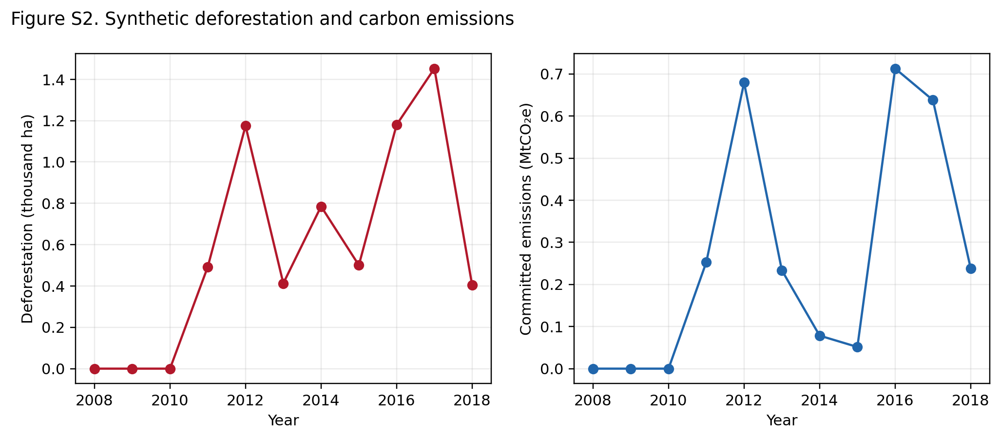

<p class="figure-caption">Figure S2. Annual synthetic deforestation and committed carbon emissions inside the signatory direct zone.</p>

## 7. How the supply-zone radius is chosen for each plant and year

Rather than applying one fixed radius to every plant, which would draw the
same size circle around a plant with a tightly clustered set of suppliers as
around one whose suppliers are scattered over a much wider area, the
workflow tests a whole range of candidate distances for each plant-year and
keeps whichever one shows the strongest cattle-volume-weighted spatial
clustering. Intuitively: as the candidate distance grows outward from the
plant, the properties captured inside it either keep looking more alike in
how much cattle they sell to that plant, in which case the true edge of the
catchment has not been reached yet, or they start looking like an
unrelated, random mix, which signals that the boundary has been crossed. The
distance right before that shift is read as the natural edge of the
catchment. This produces supply zones that adapt to each plant's actual
sourcing geography instead of forcing every plant into an identical
footprint.

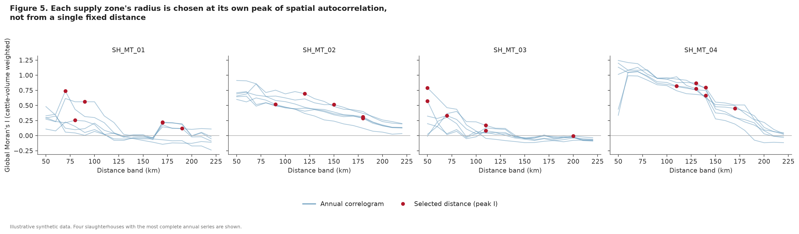

<p class="figure-caption">Figure 5. Correlogram of Moran's I against distance for four example slaughterhouses; the marked point is the distance actually used to build that plant-year's zone.</p>

## 8. Where does the cattle that leaves a signatory property end up

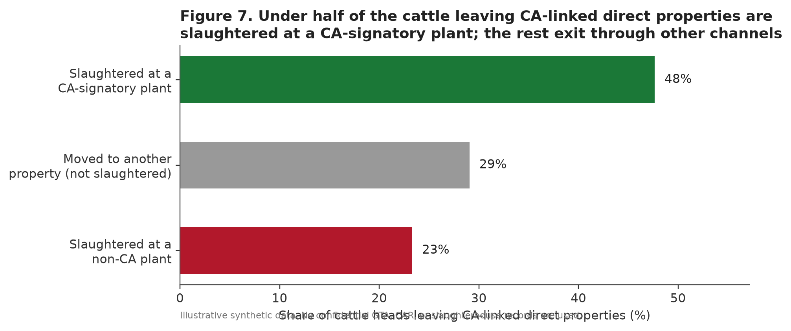

<p class="figure-caption">Figure 7. Destination of cattle heads that leave signatory direct properties.</p>

A sourcing commitment made by a signatory plant only covers the animals it
buys directly; it says nothing about what happens to cattle once they leave
one of that plant's own supplier properties for somewhere else. In this
synthetic scenario, only part of the cattle leaving a signatory direct
property is slaughtered at a signatory plant at all. The remainder is either
slaughtered at a plant with no sourcing commitment or moved on to another
property first, re-entering the same invisible chain described in Section
1. That second pathway is precisely the leakage that indirect-supplier
monitoring, the tier-1 layer built earlier in this workflow, is designed to
catch, since it follows the animal one step further instead of stopping at
the first sale.

## 9. How far apart are direct suppliers, indirect suppliers, and rival plants

Distance shapes both how practical monitoring is and how competitive the
local market for cattle looks. A tier-1 indirect supplier that sits far from
any direct supplier is harder and more expensive to fold into a monitoring
program, since verification usually means an actual visit to the property.
A signatory plant that sits close to a non-signatory rival, meanwhile, is
competing for cattle from a similar pool of nearby farms, which is part of
why the two plant types' supply zones showed meaningful overlap in Section
3. The two distributions below summarize both distances across every
plant-year in the synthetic dataset.

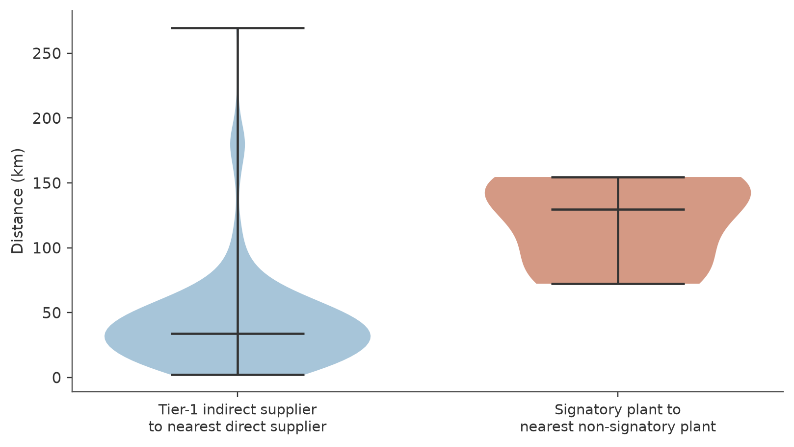

<p class="figure-caption">Figure 8. Distribution of two distance measures: tier-1 indirect supplier to nearest direct supplier, and signatory plant to nearest non-signatory plant.</p>

## 10. What would happen if monitoring were extended

Every one of the choices above, how far monitoring reaches, is ultimately a
budget decision: verifying a supplier costs money and staff time, so a
company or regulator has to decide how much coverage is worth the added
cost. The table below lays out that trade-off as four concrete scenarios,
from monitoring only a plant's direct signatory suppliers up to monitoring
every direct and tier-1 indirect supplier regardless of sourcing commitment.

| Monitoring scenario | Zone area (million ha) | Properties covered | Slaughter volume covered (%) |
| --- | --- | --- | --- |
| Current (signatory direct only) | 15.6 | 115 | 54.8% |
| Add signatory tier-1 indirect | 16.1 | 127 | 60.3% |
| Add non-signatory direct | 23.8 | 168 | 77.6% |
| All direct and tier-1 suppliers | 24.2 | 168 | 77.6% |

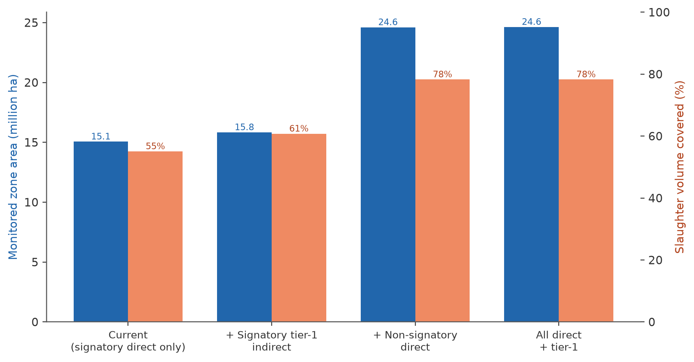

<p class="figure-caption">Figure 6. Monitored area and slaughter-volume coverage under four expansion scenarios.</p>

Adding non-signatory direct suppliers to the monitored footprint captures
far more of the slaughter volume in this synthetic scenario than adding
tier-1 indirect suppliers of signatory plants does, but it also requires
monitoring a substantially larger area. Neither pathway is free, and this is
exactly the coverage-versus-scope trade-off that any traceability system,
public or private, has to navigate deliberately rather than by default.

## 11. Does the choice of method matter

| Method | Mean zone area (million ha) | Median overestimate vs. this workflow (%) |
| --- | --- | --- |
| Incremental spatial-autocorrelation (this workflow) | 1.7 | - |
| Simple radial buffer around the plant | 13.7 | 783.0% |
| Supplier convex-hull proxy | 6.2 | - |

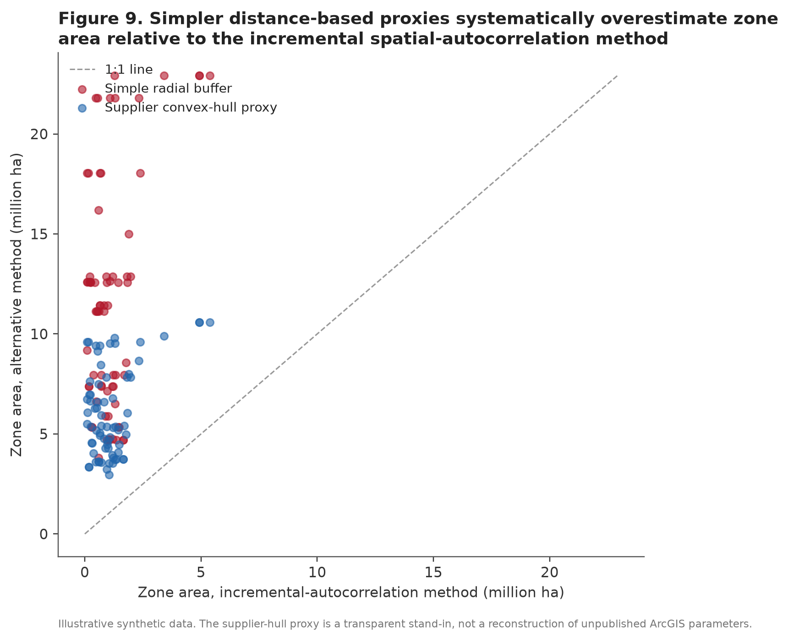

<p class="figure-caption">Figure 9. Zone area under the incremental spatial-autocorrelation method compared with two simpler distance-based proxies.</p>

Simple proxies, such as drawing a fixed-radius buffer around the plant, tend
to overestimate the true supply zone because they cannot see the actual
shape of a plant's supplier base. A fixed radius treats a scattered ring of
farms and a tight cluster the same way, the same way a single circle drawn
around a group of houses would badly misrepresent them if the houses
actually lined up along one road instead of spreading out evenly in every
direction. The overestimate is largest, sometimes by more than an order of
magnitude, in plant-years where the true supply zone is small and tightly
clustered, since that is exactly where a generic circle overshoots the most.
The median is reported above rather than the mean because a handful of
these small-zone plant-years produce extreme percentage overestimates that
would otherwise dominate the average and make the typical case look worse
than it is. Either way, this is a methodological caution for anyone tempted
to shortcut the distance-selection step in Section 7 to save computation
time: the shortcut has a real, quantifiable cost in accuracy.

## 12. Where the supply zone sits geographically, region by region

Aggregate area totals like those in Section 3 can hide a lot: two regions
with the same total supply-zone area could look completely different if one
has that area concentrated in a single corner while the other has it spread
thinly across the whole territory. The map below breaks the cumulative
signatory direct zone down by region, showing what share of each region's
own territory it actually covers.

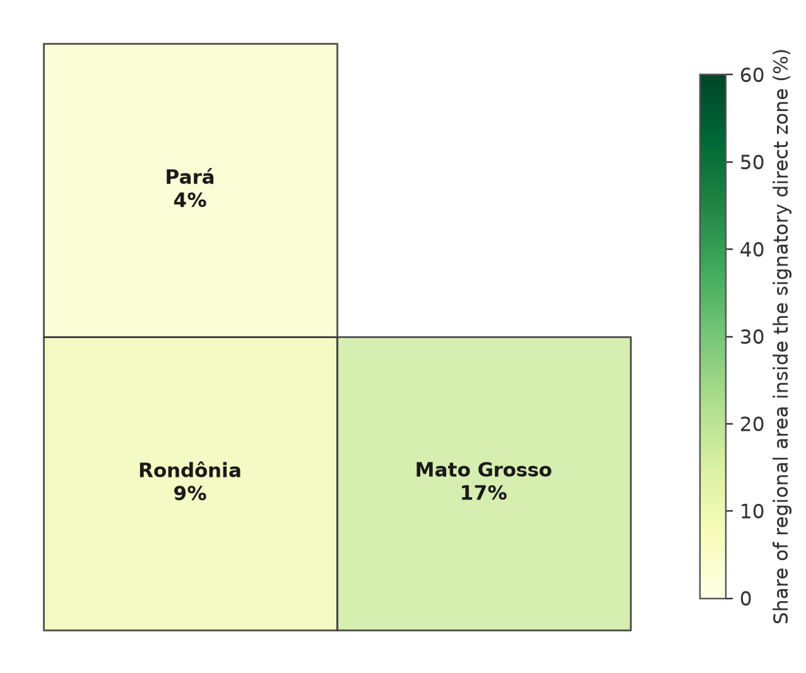

<p class="figure-caption">Figure 11. Share of each region's territory that falls inside the cumulative signatory direct supply zone.</p>

## 13. Limitations

Every workflow makes simplifying choices, and being explicit about them is
part of what makes a method trustworthy. The most important ones here are:

- **All data are synthetic.** Every property boundary, transaction, and
  slaughterhouse in this repository was generated for testing purposes and
  carries no relationship to actual locations, companies, or individuals.
  No result in this report should be read as a claim about any real place.
- **The open-source distance-selection and aggregation methods are declared
  analogues, not certified reproductions,** of the original study's ArcGIS
  Pro routines; see `docs/ARCGIS_EQUIVALENCE.md` for a line-by-line
  comparison of assumptions between the two.
- **Land-use and deforestation layers are simplified** into four classes and
  a single annual raster; the original study's underlying data sources are
  considerably richer and would need to be substituted for any empirical
  application.
- **Supplier-hull and radial-buffer comparisons are illustrative proxies**
  built for this repository to make Section 11's point concretely; they
  should not be read as a critique of any specific commercial GIS workflow.

## 14. How to reproduce every number in this report

```
python -m venv .venv
source .venv/bin/activate
python -m pip install -e ".[dev]"
python -m supply_zones all --clean
pytest
```

Running these four commands regenerates the synthetic input data from
scratch, reruns every analytical step described above in the same order,
rebuilds every figure and table referenced in this report, including this
document itself, and runs the automated QA gates recorded in
`outputs/qa/QA_REPORT.md`. Because the process starts from a fixed random
seed, repeating it should reproduce substantively identical results every
time, which is the whole point of building the workflow this way.

## Citation

Please cite the original article for the underlying method, and
`CITATION.cff` in this repository for the synthetic reproduction code.
